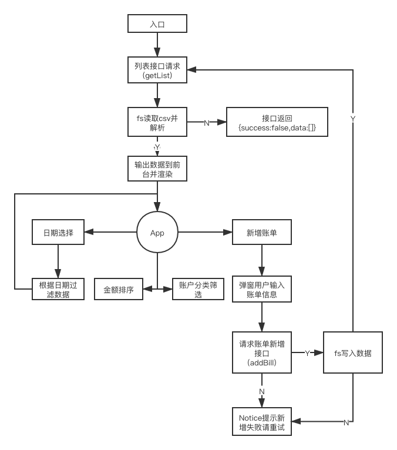

## 简易的记账本 [https://github.com/funnyPan/xmind-work](https://github.com/funnyPan/xmind-work)

项目需求：构建一个简易的记账本应用程序

项目地址：[https://github.com/xmindltd/hiring/blob/master/frontend-1/README.md](https://github.com/xmindltd/hiring/blob/master/frontend-1/README.md)

## 需求分析

1. 读写csv文件
2. 日期筛选
3. 统计收支总额及支出明细
4. 日期转化及账单分类对应
5. 账单分类筛选
6. 金额排序



## 技术选型

1. nodejs
    1. hapi.js //提供rest api
    2. papaparse //解析csv
    3. dayjs //解析时间
2. vue //页面渲染
3. nodemon //持久化运行node服务
4. webpack //打包页面
5. iview //组件库

## 开发环境

1. WebStorm
2. Mac os 10.15.4
3. iterm2
4. node 12.16.3
5. chrome
6. docker 19.03.8

## 安装部署

1. 本地

``` shell script 
git clone https://github.com/funnyPan/xmind-work.git
cd xmind-work
npm install
npm run build
nodemon app.js
访问 http://localhost:3333/index.html
```

2. docker(推荐)

docker version=19.03.8

``` shell script
docker build -t xmind .
docker run -d -p 3333:3333 xmind
访问 http://localhost:3333/index.html
```